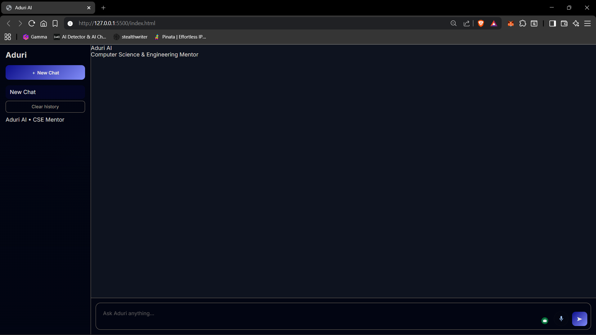
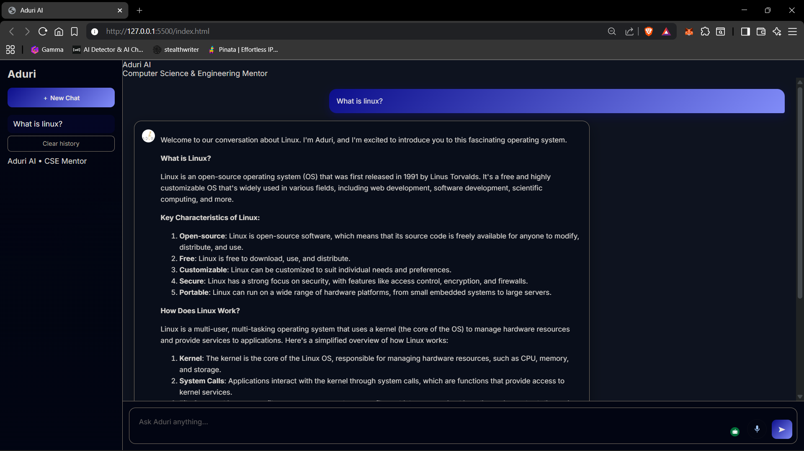

# 🤖 Aduri AI

**Aduri AI** is a modern, bilingual (Bangla 🇧🇩 + English 🇺🇸) AI assistant designed with a clean UI and real-world usability in mind.  
It supports **text and voice interaction**, maintains **chat history**, and delivers a smooth, ChatGPT-like experience using a lightweight web stack.

Aduri is built to feel **professional, responsive, and human**, not like a demo chatbot.

---

## ✨ Features

### 🧠 Intelligent Chat
- Context-aware multi-turn conversations
- Chat history stored locally (per session)
- Markdown-rendered AI responses

### 🎤 Voice + Text Interaction
- **Text input → Text reply**
- **Voice input → Voice reply**
- Automatic language detection (Bangla / English)
- Female voice output using Web Speech API

### 🎧 Voice Experience
- Modern mic button with animated “listening” state
- Smooth start/stop behavior
- Instant voice cut using Stop button (⏹)

### 🛑 Control & Safety
- Stop AI response anytime (like ChatGPT)
- Clear all chat history with confirmation
- No accidental data loss

### 🎨 Modern UI
- Dark-mode first design
- Sidebar chat history
- Smooth animations and transitions
- Responsive layout

### 🎓 Why Students Use Aduri (Instead of Generic AI Tools)

Aduri is not designed to replace general-purpose AI platforms like ChatGPT.
It is designed to serve students better, especially Computer Science & Engineering learners.

### 📚 Built for Learning, Not Just Answering
Most AI tools focus on giving quick answers.
Aduri focuses on teaching.
- Step-by-step explanations instead of one-shot replies
- Concepts explained from a student’s perspective
- Emphasis on understanding, not memorization
- Suitable for exam preparation and revision
- Students feel like they are learning from a mentor, not querying a search engine.

### 🌍 Bangla + English, Naturally

Many students think in Bangla but study in English.
Aduri:
- Detects Bangla automatically
- Explains concepts in clear academic Bangla
- Uses English technical terms where appropriate
- Supports Bangla voice input and output
- This lowers the barrier for understanding complex CS topics.

### 🧠 Conversation Memory That Feels Personal
Aduri remembers the context of a learning session.
- Keeps track of recent explanations
- Avoids repeating the same basics unnecessarily
- Maintains flow in long study sessions

This makes studying feel continuous, not fragmented.

### 🎙️ Voice-First Study Experience
Students don’t always want to type.
Aduri supports:
- Voice questions
- Spoken explanations
- Hands-free learning

Useful for revision, quick doubts, or learning while multitasking.

### 🧑‍🏫 Less Intimidating, More Approachable
Many students hesitate to ask “simple” or “confusing” questions.
Aduri is designed to be:
- Friendly
- Patient
- Beginner-safe

This encourages curiosity and repeated use.

### 🎯 Focused Audience, Better Experience
Aduri is intentionally focused on:
-nComputer Science students
- Engineering learners
- Beginners and intermediate-level users

By not trying to do everything for everyone, Aduri delivers a clearer and more relevant experience for its target users.

---

## 🛠️ Tech Stack

### Frontend
- **HTML5**
- **CSS3** (custom, no framework)
- **Vanilla JavaScript (ES Modules)**
- **Web Speech API**
  - `webkitSpeechRecognition`
  - `speechSynthesis`
- **Marked.js** for Markdown rendering

### Backend
- **Node.js**
- **Express.js**
- **Groq API** (LLM backend)

### Storage
- `localStorage` (chat history)

---
## 🖼️ Screenshots

### Home Screen


### Chat Interface


---
## 📁 Project Structure

    ```text
    ADURI-AI/
    │
    ├── ADURI-UI/
    │   ├── index.html
    │   ├── css/
    │   │   └── style.css
    │   ├── js/
    │   │   ├── app.js
    │   │   ├── chat.js
    │   │   ├── api.js
    │   │   ├── history.js
    │   │   └── utils/
    │   └── assets/
    │       └── avatar.png
    │
    ├── ADURI-SERVER/
    │   ├── server.js
    │   ├── aiService.js
    │   └── routes/
    │
    └── README.md
---
## 🚀 Getting Started
### 1️⃣ Clone the repository
    git clone https://github.com/your-username/aduri-ai.git
    cd aduri-ai
### 2️⃣ Setup Backend
    cd ADURI-SERVER
    npm install
Create a .env file:

    GROQ_API_KEY=your_api_key_here
    PORT=3000
Run the server:
    
    npm start
### 3️⃣ Run Frontend
Simply open:
    
    ADURI-UI/index.html
in a modern browser (Chrome recommended for voice features).

## 🎤 Voice Requirements

- Chrome / Edge recommended
- Microphone permission required
- HTTPS required for voice on deployed environments


## 🔐 Privacy Notes

- No chat data is uploaded or stored remotely
- All chat history lives in browser localStorage
- Microphone is used only when user clicks mic

## 📌 Future Enhancements

- Streaming responses (token-by-token)
- Regenerate response button
- Voice intensity visualization
- User-selectable voice styles
- Account-based chat sync

## 👨‍💻 Author

**Abir**  
Computer Science & Engineering Student  
Focused on building practical, production-quality systems.

